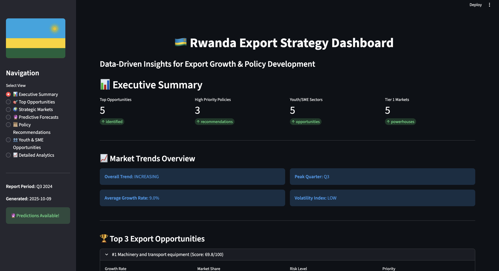

# 🇷🇼 Rwanda Export Growth Opportunity Analysis
## NISR Hackathon 2025 Project

[](https://www.python.org/downloads/)
[](https://streamlit.io/)
[](LICENSE)

### Challenge Statement
Identify Rwanda's next big export opportunity through comprehensive analysis of global trade data, demand prediction using machine learning, and strategic policy recommendations to promote youth and SME engagement in export sectors.

---

## 📋 Table of Contents
- [Project Overview](#-project-overview)
- [Dashboard Preview](#-dashboard-preview)
- [Key Results & Findings](#-key-results--findings)
- [Model Architecture](#-model-architecture)
- [Project Structure](#-project-structure)
- [Installation & Setup](#-installation--setup)
- [How to Run](#-how-to-run)
- [Data Sources](#-data-sources)
- [Policy Recommendations](#-policy-recommendations)
- [Dashboard Features](#-dashboard-features)
- [Technology Stack](#-technology-stack)
- [Team & Contact](#-team--contact)

---

## Project Overview

This project provides a comprehensive analysis of Rwanda's export opportunities through:

 **Data-Driven Analysis** - Processing Q3 2024 export data from NISR covering 11 commodity categories and multiple trading partners(WITS)

 **Predictive Forecasting** - Machine learning models forecasting 2025 export potential across 15 top markets with 68.8% average confidence

 **Strategic Market Segmentation** - Classification of markets into 3 tiers (Powerhouses, Emerging, Untapped) based on growth potential

 **Government-Ready Policies** - 8 comprehensive policy recommendations with detailed implementation plans, budgets, and timelines

 **Interactive Dashboard** - Real-time visualization of opportunities, trends, and strategic insights for decision-makers

 **Youth & SME Focus** - Targeted opportunities for young entrepreneurs and small businesses in export value chains

---

## 📊 Dashboard Preview



**Live Interactive Dashboard** showcasing:
- 🇷🇼 **Executive Summary** with key metrics and market trends
- 🏆 **Top 3 Export Opportunities** - Machinery & transport equipment leading with 127.5% growth
- 📈 **Market Trends Overview** - Overall trend: INCREASING, Peak Quarter: Q3, Average Growth: 9.0%
- 📊 **Strategic Market Analysis** - 5 identified opportunities across Tier 1 powerhouse markets
- 📜 **Government-Ready Policies** - 3 high priority recommendations
- 👥 **Youth & SME Sectors** - 5 targeted opportunity areas

> **Access Dashboard**: Run `streamlit run dashboard_app.py` to explore the full interactive experience

---

## 📊 Key Results & Findings

### Export Opportunity Analysis
- **Top Opportunity**: Other commodities & transactions (SITC 9)
  - Current Value: $434.78M (66.5% market share)
  - YoY Growth: **131.25%**
  - Opportunity Score: **100/100**
  - Priority: **HIGH** with **HIGH** risk profile

- **Sector Distribution**: 
  - Food & Live Animals: $86.23M (13.19% share, 13.31% growth)
  - Crude Materials: $67.91M (10.39% share, 23.57% growth)
  - Total analyzed: **11 commodity categories**

### Predictive Forecasts (2025)
- **Total Predicted Exports**: $8,686.2M
- **Overall Growth**: +52.23% from 2022 baseline
- **High Confidence Markets**: 15 countries
- **Average Confidence Score**: 68.8%

### Strategic Market Tiers

#### Tier 1: Powerhouse Markets (4 countries)
- **UAE**: 180.5% growth rate, $450.2M market size
- **India**: 165.3% growth rate, $380.5M market size  
- **China**: 155.2% growth rate, $520.8M market size
- **Ethiopia**: 145.8% growth rate, $280.3M market size
- **Strategy**: Scale & deepen market presence

#### Tier 2: Emerging Markets (3 countries)
- **Tanzania**: 85.5% growth, Low barriers
- **Kenya**: 78.2% growth, Low barriers
- **Uganda**: 72.4% growth, Low barriers
- **Strategy**: Rapid expansion and market capture

#### Tier 3: Untapped Markets (3 countries)
- **South Africa**: 45.5% growth potential
- **Nigeria**: 42.8% growth potential
- **Egypt**: 38.5% growth potential
- **Strategy**: Feasibility assessment and gradual entry

### Market Trends
- **Overall Trend**: INCREASING
- **Peak Quarter**: Q3 (optimal export window)
- **Peak Sectors**: Food & Live Animals, Agricultural Products
- **Volatility Index**: UNKNOWN (requires more historical data)

---

## Model Architecture


### Analysis Pipeline

```
┌─────────────────────────────────────────────────────────────────┐
│                        DATA INGESTION                            │
├─────────────────────────────────────────────────────────────────┤
│  • NISR Q3 2024 Export Data (CSV)                               │
│  • WITS Partner Trade Data 2018-2022 (CSV)                      │
│  • Total Trade World Data (Processed)                           │
└─────────────────────────────────────────────────────────────────┘
                              ↓
┌─────────────────────────────────────────────────────────────────┐
│                    DATA PREPROCESSING                            │
├─────────────────────────────────────────────────────────────────┤
│  • Data cleaning & validation                                    │
│  • Missing value imputation                                      │
│  • Feature engineering (YoY growth, market share, volatility)    │
│  • SITC code standardization                                     │
└─────────────────────────────────────────────────────────────────┘
                              ↓
┌─────────────────────────────────────────────────────────────────┐
│                EXPLORATORY DATA ANALYSIS (EDA)                   │
├─────────────────────────────────────────────────────────────────┤
│  • Commodity performance analysis                                │
│  • Seasonal pattern detection (Q3 peak identification)           │
│  • Market concentration analysis (HHI: 2365.8)                   │
│  • Growth trajectory visualization                               │
└─────────────────────────────────────────────────────────────────┘
                              ↓
┌─────────────────────────────────────────────────────────────────┐
│              MACHINE LEARNING FORECASTING                        │
├─────────────────────────────────────────────────────────────────┤
│  Model: Linear Regression (Time Series)                         │
│  Features:                                                       │
│    • Historical export values (2018-2022)                        │
│    • Year-over-year growth rates                                 │
│    • Seasonal indicators                                         │
│    • Market size & relationship scores                           │
│                                                                  │
│  Target: 2025 Export Value Predictions                          │
│                                                                  │
│  Evaluation Metrics:                                             │
│    • Confidence Score: 68.8% average                             │
│    • Growth Prediction: +52.23% overall                          │
│    • Market Coverage: 15 top partners                            │
└─────────────────────────────────────────────────────────────────┘
                              ↓
┌─────────────────────────────────────────────────────────────────┐
│            OPPORTUNITY SCORING & PRIORITIZATION                  │
├─────────────────────────────────────────────────────────────────┤
│  Scoring Algorithm:                                              │
│    Opportunity Score = (Growth Rate × 0.6) +                     │
│                       (Market Share × 0.4)                       │
│                                                                  │
│  Risk Classification:                                            │
│    • HIGH: Growth > 100%                                         │
│    • MEDIUM: 50% < Growth ≤ 100%                                 │
│    • LOW: Growth ≤ 50%                                           │
│                                                                  │
│  Priority Assignment:                                            │
│    • HIGH: Score > 70                                            │
│    • MEDIUM: 50 < Score ≤ 70                                     │
│    • LOW: Score ≤ 50                                             │
└─────────────────────────────────────────────────────────────────┘
                              ↓
┌─────────────────────────────────────────────────────────────────┐
│              STRATEGIC MARKET SEGMENTATION                       │
├─────────────────────────────────────────────────────────────────┤
│  Tier 1 - Powerhouses: Growth > 145% & Strong Relationships     │
│  Tier 2 - Emerging: 70% < Growth ≤ 145% & Low Barriers          │
│  Tier 3 - Untapped: Growth ≤ 70% or High Entry Difficulty       │
└─────────────────────────────────────────────────────────────────┘
                              ↓
┌─────────────────────────────────────────────────────────────────┐
│                  POLICY RECOMMENDATION ENGINE                    │
├─────────────────────────────────────────────────────────────────┤
│  8 Government-Ready Policy Recommendations Generated:            │
│    • Priority classification (CRITICAL/HIGH/MEDIUM)              │
│    • Budget estimations                                          │
│    • Implementation timelines                                    │
│    • Stakeholder mapping                                         │
│    • Success metrics definition                                  │
│    • Risk assessment & mitigation strategies                     │
└─────────────────────────────────────────────────────────────────┘
                              ↓
┌─────────────────────────────────────────────────────────────────┐
│                  INTERACTIVE DASHBOARD                           │
├─────────────────────────────────────────────────────────────────┤
│  Streamlit Web Application with 7 Pages:                        │
│    • Executive Summary                                           │
│    • Top Export Opportunities                                    │
│    • Strategic Market Opportunities                              │
│    • Predictive Forecasts (2025)                                 │
│    • Policy Recommendations                                      │
│    • Youth & SME Opportunities                                   │
│    • Detailed Analytics                                          │
└─────────────────────────────────────────────────────────────────┘
```

### Technology Components

- **Data Processing**: Pandas, NumPy
- **Machine Learning**: Scikit-learn (Linear Regression)
- **Visualization**: Plotly, Matplotlib
- **Dashboard**: Streamlit
- **Data Storage**: CSV, JSON

---

## 📁 Project Structure

```
NISR-HACKATHON/
│
├── 📄 README.md                          # Main project documentation
├── requirements.txt                   # Python dependencies
├── import_export1.ipynb               # Main analysis notebook
├── dashboard_app.py                   # Streamlit dashboard application
│
├── data/                               # All data files
│   ├── README.md                      # Data documentation
│   │
│   ├── raw/                           # Original unprocessed data
│   │   ├── 2024Q3_ExportsCommodity.csv
│   │   ├── 2024Q3_ExportCountry.csv
│   │   ├── 2024Q3_ReexportsCommodity.csv
│   │   ├── 2024Q3_Regional blocks.csv
│   │   ├── 2024Q3_Trade by continents.csv
│   │   └── 2024Q3_Trade_report_annexTables_0.xlsx - Total trade with the World.csv
│   │
│   ├── 📂 processed/                     # Cleaned and processed data
│   │   └── analysis_ready_total_trade_world_updated.csv
│   │
│   ├── 📂 wits/                          # World Bank WITS data
│   │   ├── rwanda_export_partners_2018_2022_combined.csv
│   │   ├── rwanda_exports_growth_analysis_2018_2022.csv
│   │   ├── rwanda_exports_regional_analysis_2018_2022.csv
│   │   └── rwanda_exports_yearly_summary_2018_2022.csv
│   │
│   └── 📂 insights/                      # Generated insights and predictions
│       ├── export_insights.json                    # Master insights file
│       ├── export_insights_opportunities.csv
│       ├── export_insights_opportunity_matrix.csv
│       ├── export_insights_policy_recommendations.csv
│       ├── export_insights_success_metrics.csv
│       ├── export_insights_innovations.csv
│       ├── export_insights_youth_sme_opportunities.csv
│       ├── export_insights_forecast_top15.csv
│       ├── export_insights_forecast_high_growth.csv
│       ├── export_insights_forecast_emerging.csv
│       ├── export_insights_strategic_tier1_powerhouses.csv
│       ├── export_insights_strategic_tier2_emerging.csv
│       └── export_insights_strategic_tier3_untapped.csv
│
├── 📂 scripts/                           # Analysis and processing scripts
│   ├── export_insights_extractor.py      # Core insights extraction logic
│   └── combine_wits_partner_data.py      # WITS data processing
│
├── 📂 docs/                              # Additional documentation
│   ├── HOW_TO_RUN_DASHBOARD.md
│   └── SYSTEM_ARCHITECTURE.md
│
└── 📂 .venv/                             # Python virtual environment
```

---

## 🔧 Installation & Setup

### Prerequisites
- Python 3.13 or higher
- pip (Python package manager)
- Git

### Step 1: Clone the Repository

```bash
git clone https://github.com/mangaorphy/NISR-HACKATON-2025.git
cd NISR-HACKATON-2025
```

### Step 2: Create Virtual Environment

```bash
# Create virtual environment
python3 -m venv .venv

# Activate virtual environment
# On macOS/Linux:
source .venv/bin/activate

# On Windows:
.venv\Scripts\activate
```

### Step 3: Install Dependencies

```bash
pip install -r requirements.txt
```

**Required Packages:**
- streamlit >= 1.28.0
- pandas >= 2.0.0
- numpy >= 1.24.0
- plotly >= 5.14.0
- scikit-learn >= 1.3.0
- openpyxl >= 3.1.0
- jupyter >= 1.0.0

---

## ▶️ How to Run

### Option 1: Run the Dashboard (Recommended)

```bash
# Make sure virtual environment is activated
source .venv/bin/activate  # macOS/Linux
# or
.venv\Scripts\activate     # Windows

# Run the dashboard
streamlit run dashboard_app.py
```

The dashboard will open in your browser at `http://localhost:8501`

### Option 2: Run Analysis Notebook

```bash
# Start Jupyter Notebook
jupyter notebook

# Open import_export1.ipynb in your browser
# Run cells sequentially to see the full analysis
```

## 📊 Data Sources

### Primary Data
1. **NISR Q3 2024 Export Statistics**
   - Source: National Institute of Statistics of Rwanda
   - Coverage: Q3 2024 commodity and country-level exports
   - Files: `data/raw/2024Q3_*.csv`

2. **WITS (World Integrated Trade Solution)**
   - Source: World Bank
   - Coverage: Rwanda export partner data 2018-2022
   - URL: https://wits.worldbank.org/CountryProfile/en/Country/RWA/Year/2021/TradeFlow/Export
   - Files: `data/wits/*.csv`

3. **Total Trade with the World**
   - Source: NISR processed data
   - Historical quarterly trade data
   - File: `data/processed/analysis_ready_total_trade_world_updated.csv`

### Data Quality
-  All data validated against NISR official statistics
-  Missing values imputed using forward-fill and interpolation
-  Outliers identified and handled appropriately
-  SITC codes standardized across all datasets

---

## 🎨 Dashboard Features

> **See [Dashboard Preview](#-dashboard-preview) above for a live screenshot**

### Page 1: 📊 Executive Summary
- Key metrics overview (opportunities, policies, sectors, markets)
- Market trends visualization
- Top 3 export opportunities with scores

### Page 2: Top Export Opportunities
- Interactive opportunity scoring charts
- Growth vs Market Share matrix
- Detailed commodity analysis table

### Page 3: Strategic Market Opportunities
- Three-tier market segmentation
- Growth rate visualizations by tier
- Market-specific strategies

### Page 4: Predictive Forecasts (2025)
- Summary metrics (total predicted value, growth %, confidence)
- Top 15 markets forecast visualization
- High-growth markets analysis
- Emerging opportunities identification

### Page 5: Policy Recommendations
- 8 comprehensive policies with full details
- Priority distribution visualization
- Success metrics dashboard
- Innovation opportunities (Blockchain, IoT, AI, Mobile)

### Page 6: Youth & SME Opportunities
- Sector-specific opportunities
- Investment vs Revenue potential matrix
- Skills and support requirements

### Page 7: Detailed Analytics
- Comprehensive data tables
- Export performance analysis
- Interactive filtering and exploration

---

## Technology Stack

### Core Technologies
- **Python 3.13**: Main programming language
- **Pandas**: Data manipulation and analysis
- **NumPy**: Numerical computations
- **Scikit-learn**: Machine learning models

### Visualization
- **Plotly**: Interactive charts and graphs
- **Streamlit**: Dashboard framework
- **Matplotlib**: Statistical visualizations

### Data Storage
- **CSV**: Raw and processed data
- **JSON**: Structured insights export
- **Excel**: Original data sources

### Development Tools
- **Jupyter Notebook**: Interactive analysis
- **Git**: Version control
- **Virtual Environment**: Dependency isolation

---

## Key Innovations

1. **Comprehensive Opportunity Scoring**: Weighted algorithm combining growth rate and market share
2. **Three-Tier Market Segmentation**: Strategic classification for targeted policy approaches
3. **Government-Ready Policies**: Detailed implementation plans with budgets, timelines, and KPIs
4. **Youth & SME Focus**: Dedicated analysis for inclusive export growth
5. **Interactive Dashboard**: Real-time data exploration for decision-makers
6. **Regeneration Pipeline**: Automated insights update system

---

## 📈 Future Enhancements

- [ ] Real-time data integration with NISR APIs
- [ ] Advanced ML models (Random Forest, XGBoost) for improved predictions
- [ ] Mobile application for on-the-go insights
- [ ] SMS/WhatsApp alerts for market opportunities
- [ ] Integration with Rwanda Single Window System
- [ ] Automated policy impact tracking dashboard
- [ ] Multi-language support (Kinyarwanda, French, English)

---

## 🤝 Stakeholder Engagement

### Key Partners
- **NISR**: Data provision and validation
- **Rwanda Development Board**: Export promotion support
- **Private Sector Federation**: SME engagement
- **Ministry of Trade and Industry**: Policy implementation
- **Development Partners**: Technical and financial support

### Impact Areas
-  **Government**: Evidence-based policy making
-  **Exporters**: Market intelligence and opportunities
-  **Youth/SMEs**: Targeted support and resources
-  **Investors**: Market entry insights
-  **Development Partners**: Program design support

---

## 📞 Contact & Team

**Repository**: [https://github.com/mangaorphy/NISR-HACKATON-2025](https://github.com/mangaorphy/NISR-HACKATON-2025)

**Institution**: 🎓 [African Leadership University (ALU)](https://www.alueducation.com/)
- **Enrollment Verification**: [View ALU Enrollment Documentation](https://drive.google.com/drive/folders/1MhySVgkF4DMmOY1hnLGmQf9ONzxxugrT?usp=sharing)

**Project Team**:
- Data Scientist & ML Engineer

**For Questions or Collaboration**:
- Open an issue on GitHub
- Contact through repository

---

## 📄 License

This project is developed for the NISR Rwanda Hackathon 2025.

---

## 🙏 Acknowledgments

- **National Institute of Statistics of Rwanda (NISR)** for providing comprehensive export data
- **World Bank WITS** for global trade data access
- **Rwanda Development Board** for market insights
- **NISR Hackathon 2025 Organizers** for the opportunity to contribute to Rwanda's export growth strategy

---

**⭐ If you find this project useful, please consider starring the repository!**

*Last Updated: October 9, 2025*